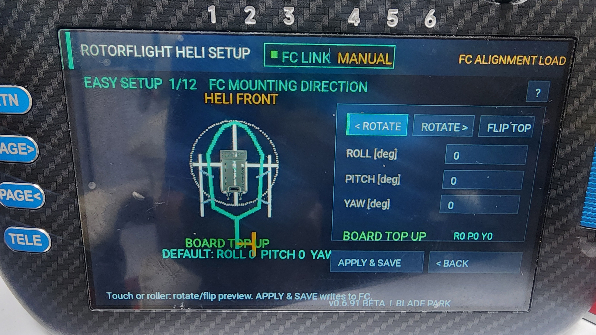
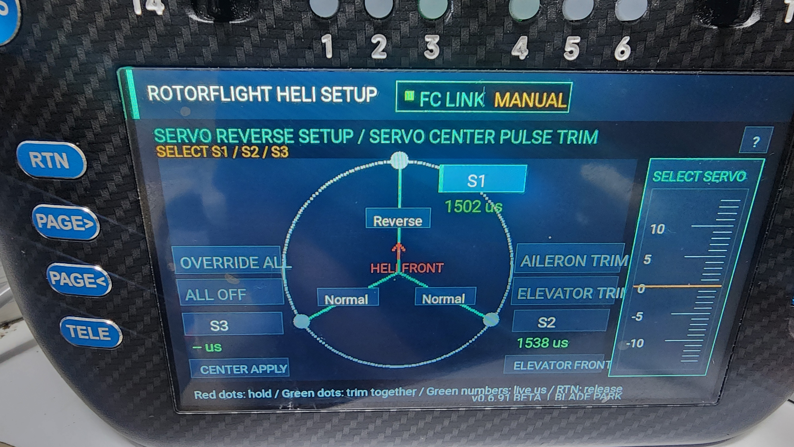
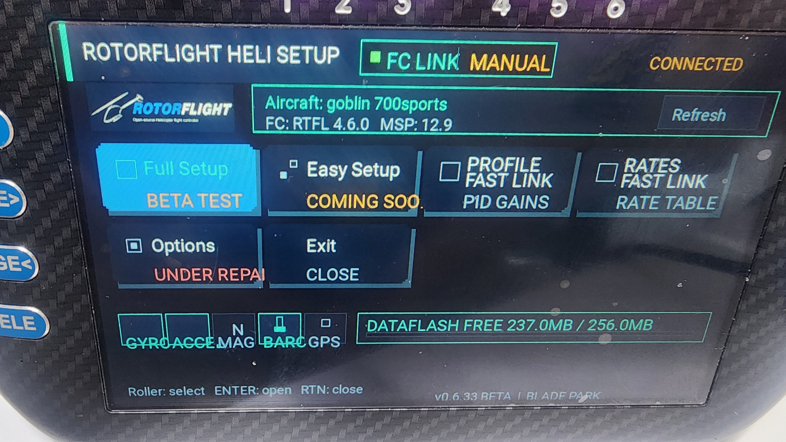
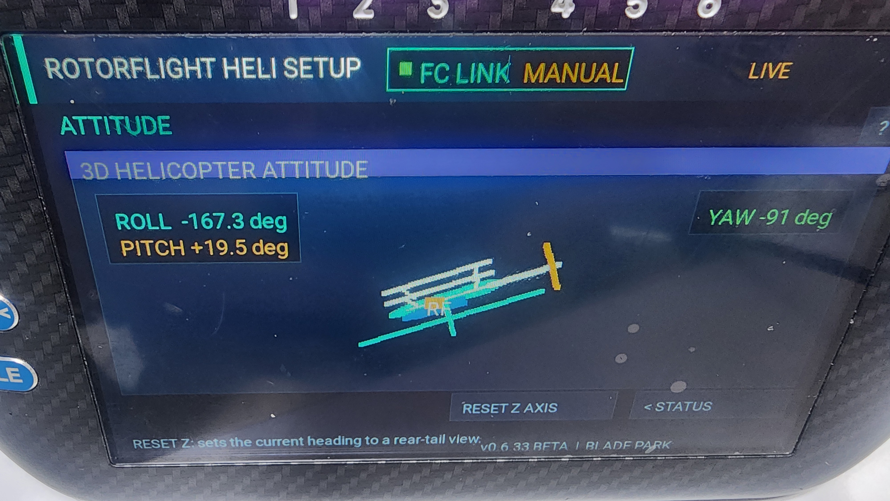
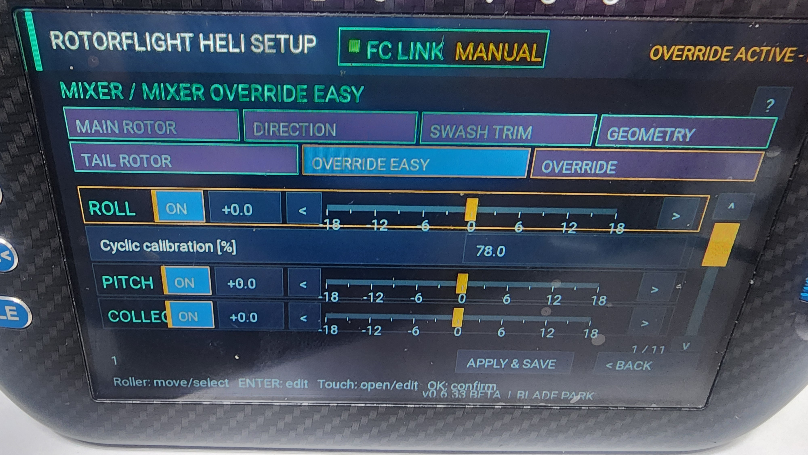
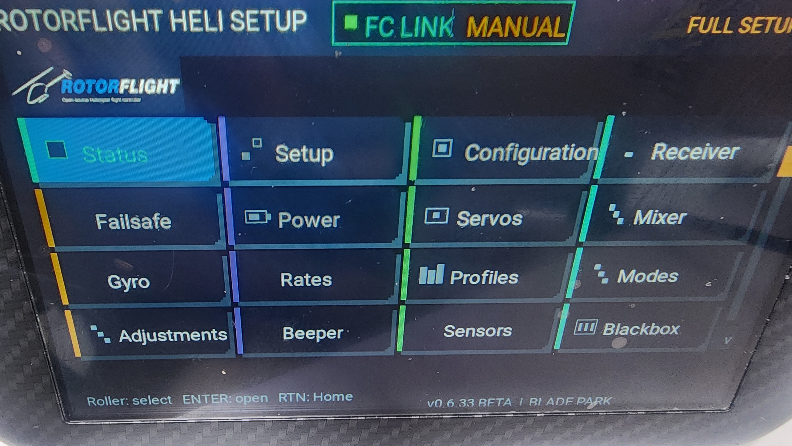

# RFLUASETUP

[한국어](#rfluasetup) · [English](#english)

RFLUASETUP은 Rotorflight Configurator 2.3.0의 메뉴 구성과 설정 방식을 분석하여 EdgeTX 조종기용 Lua 인터페이스로 구현한 프로젝트입니다. 가능한 한 많은 Configurator 기능을 PC 없이 조종기에서 확인하고 설정할 수 있도록 만드는 것이 목표입니다.

현재 버전은 **0.6.91 BETA — 개발 중인 미완성 버전**입니다. **Easy Setup은 현재 서보 센터 설정까지 구현한 중간 단계**이며, 전체 기체 설정을 완료하는 마법사가 아닙니다.

[0.6.91 BETA 다운로드 / Download](https://github.com/parksp/RFLUASETUP/releases/tag/v0.6.91-beta) · [한글·영문 변경 안내 / Bilingual release notes](RELEASE-0.6.91-BILINGUAL.md)

### Easy Setup 진행 상황

- 스와쉬 서보 기본값: 1520/760 펄스, Rate/Speed, 개별 Reverse, Limits/Scale/Geo 편집 및 저장 전 경고·확인.
- 서보 리버스·센터 펄스 트림: FRONT/REAR 선택, 기수 방향 표시, 실제 출력 펄스 확인, Center Apply 확인 후 저장.
- 오버라이드를 유지하면서 초록색으로 선택한 S1/S2/S3 조합만 트림. 빨간색 서보는 현재 위치 유지. ALL 선택과 AILERON/ELEVATOR 조정 지원.
- Easy Setup의 이후 단계는 아직 완성되지 않았습니다. **전체 설정·비행 준비 완료를 보장하지 않습니다.**

이번 변경은 모의 FC, Lua 이벤트, 화면 렌더와 문법 검사로 확인했습니다. 실제 기체·조종기의 모든 기능을 검증한 것은 아닙니다. 모터 연결과 블레이드를 분리하고, 제조사 서보 사양 및 PC Configurator 값과 대조하여 시험하세요.

**TX16S MK2:** 사용자가 잠깐 실행·동작을 확인했으며 적용 가능한 것으로 보인다고 보고했습니다. 짧은 확인에 한정되며 전체 기능·안전성·장기간 운용 검증은 아직 아닙니다.
## 조종기 실제 화면 / Actual Radio Screens

### Easy Setup — 0.6.91 BETA

사용자가 제공한 0.6.91 BETA 실제 조종기 화면입니다. Easy Setup은 서보 센터 설정까지 구현된 미완성 중간 단계입니다. 사진에 표시된 펄스값은 해당 기체의 예시이며 권장 설정값이 아닙니다.

User-provided photographs of 0.6.91 BETA running on a transmitter. Easy Setup remains unfinished, implemented through servo center setup. Pulse values shown belong to the photographed setup; they are not recommended defaults.

| FC 장착 방향 / FC mounting direction | 서보 리버스·센터 펄스 트림 / Servo reverse & center-pulse trim |
|---|---|
|  |  |

사진을 클릭하면 원본 크기로 볼 수 있습니다. / Click a photo to view the original.

### 이전 화면 / Earlier screens — 0.6.33 BETA

아래 사진은 **이전 0.6.33 BETA**를 RadioMaster TX16S MK3에서 실행한 실제 화면입니다. 현재 0.6.91의 Easy Setup 화면과는 다를 수 있습니다.

| 메인 화면 / Main screen | 3D 헬리콥터 자세 / 3D Helicopter Attitude |
|---|---|
|  |  |

| MIXER OVERRIDE EASY | FULL SETUP |
|---|---|
|  |  |
## 설치 조건

주요 개발·시험 대상은 아래 조합입니다. MK2는 위의 사용자 짧은 확인 외에 전체 검증이 완료되지 않았습니다.

| 항목 | 현재 확인 조건 |
|---|---|
| 조종기 | RadioMaster TX16S MK3 |
| 조종기 운영체제 | 해당 조종기에서 현재 사용 중인 EdgeTX 환경 |
| FC | NEXUS Gyro |
| FC 펌웨어 | 현재 사용 중인 Rotorflight 4.6.x 계열 |
| 비교 기준 | Rotorflight Configurator 2.3.0 |
| 화면 | TX16S MK3의 800 × 480 컬러 터치 화면 기준 |
| 통신 | 수신기 텔레메트리를 통한 MSP 통신이 정상적으로 구성된 모델 |
| SD 카드 경로 | `/SCRIPTS/RFLUASETUP` |

다른 EdgeTX 조종기, 화면 크기, FC, 수신기, 텔레메트리 방식과 펌웨어 버전은 아직 검증하지 않았습니다. 조건이 다르면 화면 배치, MSP 데이터 읽기, 실시간 갱신 또는 저장 기능이 정상적으로 동작하지 않을 수 있습니다.

설치 전에는 PC용 Rotorflight Configurator에서 FC 설정을 `dump` 또는 `diff`로 백업해야 합니다. 조종기 Lua를 사용할 때는 PC Configurator의 FC 연결을 종료하는 것을 권장합니다.

## 검증 범위

- 개발 중인 미완성 BETA이며 Easy Setup은 서보 센터 설정까지의 중간 단계입니다.
- 장기간 실제 운용이나 다양한 기체 조합의 검증은 아직 진행되지 않았습니다.
- 최신 변경은 모의 FC의 읽기/쓰기, 확인 후 저장, 다중 선택 트림, 오류 처리와 화면 검사로 확인했습니다. 실기 검증은 별도로 필요합니다.
- 현재 검증 대상은 **RadioMaster TX16S MK3의 현재 EdgeTX 환경**과 **NEXUS Gyro의 현재 Rotorflight 4.6.x 펌웨어** 조합입니다.
- 다른 조종기, 화면 해상도, FC 및 펌웨어에서의 동작은 보장하지 않습니다.

실제 비행에 적용하기 전에 Rotorflight Configurator 2.3.0과 모든 값을 비교하고, 모터와 블레이드를 안전하게 분리한 상태에서 벤치 테스트를 진행하십시오. 사용과 설정 변경의 판단 및 책임은 사용자에게 있습니다.

## 설치

1. 최신 Release ZIP을 내려받습니다.
2. ZIP 안의 `SD-CARD/SCRIPTS` 폴더를 조종기 SD 카드 최상위에 복사합니다.
3. 최종 경로가 `/SCRIPTS/RFLUASETUP/main.lua`인지 확인합니다.
4. 기존 버전이 있다면 폴더 전체를 교체합니다. 서로 다른 버전의 파일을 섞지 마십시오.
5. EdgeTX를 재시작하고 시스템 또는 TOOLS 페이지에서 RFLUASETUP을 실행합니다.
6. 상단의 `FC LINK`와 하단의 `v0.6.91 BETA`를 확인합니다.

자세한 내용은 [한국어 설치 안내](설치방법.txt)와 [최신 한글·영문 변경 안내](RELEASE-0.6.91-BILINGUAL.md)를 참고하십시오. [0.6.33 한국어 사용자 매뉴얼](docs/RFLUASETUP-0.6.33-한국어-사용자-매뉴얼.docx)은 이전 버전 참고용입니다.

## English

RFLUASETUP is an EdgeTX transmitter Lua interface developed from the menus and configuration workflow of Rotorflight Configurator 2.3.0. The goal is to make as much of the Configurator as practical available directly from the transmitter.

This is **0.6.91 BETA — unfinished, work in progress**. **Easy Setup is at an intermediate stage, implemented through servo center setup.** It is not a complete helicopter setup wizard and does not establish flight readiness.

### Easy Setup progress

- Swash servo defaults: 1520/760 pulse presets, Rate/Speed, per-servo Reverse, Limits/Scale/Geo, with an overwrite warning and confirmation before saving.
- Servo reverse and center-pulse trim: FRONT/REAR choice, nose-direction indicators, measured output pulses and confirmed Center Apply.
- Keep overrides enabled while trimming any green-selected S1/S2/S3 subset; red servos hold their current positions. ALL selection and AILERON/ELEVATOR trim are available.
- Later Easy Setup stages are not complete. **This release is not a finished, flight-validated setup solution.**

Current changes were checked with a simulated FC, Lua event tests, rendered screens and syntax checks. They are not fully validated on physical aircraft/transmitters. Disconnect the motor and remove blades for bench testing; check manufacturer servo specifications and compare settings with the PC Configurator.

**TX16S MK2:** The user reports a brief run/operation check and that the tool appears to work. This is only a preliminary user observation, not full feature, safety or long-term validation.

The current test target is RadioMaster TX16S MK3 with its current EdgeTX environment and NEXUS Gyro with the currently used Rotorflight 4.6.x firmware. Other hardware and firmware combinations are not guaranteed.
### Installation Requirements

- RadioMaster TX16S MK3
- The currently tested EdgeTX environment on that transmitter
- NEXUS Gyro
- The currently tested Rotorflight 4.6.x firmware
- Rotorflight Configurator 2.3.0 as the comparison reference
- Working receiver telemetry and MSP communication
- Installation path `/SCRIPTS/RFLUASETUP`

Other transmitters, display sizes, FCs, receivers, telemetry protocols, and firmware versions remain unverified. Back up the FC with `dump` or `diff` before installation and close the PC Configurator connection while using the transmitter Lua tool.

See [English installation](INSTALL-EN.txt) and [current bilingual release notes](RELEASE-0.6.91-BILINGUAL.md). The [0.6.33 English user manual](docs/RFLUASETUP-0.6.33-English-User-Manual.docx) and photographs specifically labeled 0.6.33 describe the older release and may not match current Easy Setup screens. The Easy Setup photos labeled 0.6.91 show the current release.

## Main Areas

- Status and live receiver channels
- Setup and Configuration
- Receiver, telemetry sensors, Failsafe and Power
- Motors, RPM gear ratio and motor override
- Governor and bypass curve
- Servos and Mixer
- Gyro, Rates and PID Profiles
- Modes and Adjustments
- Beepers, Sensors and Blackbox

## Collaboration

Bug reports, test results, translations and code improvements are welcome. Read [CONTRIBUTING.md](CONTRIBUTING.md) before submitting an issue or pull request.

## Credits

Created by **BLADE PARK**. This independent Lua project is based on the behavior and public source of Rotorflight Configurator and Rotorflight firmware. Rotorflight names, logos and upstream source remain the property of their respective owners and contributors.

## License

Released under the GNU General Public License v3.0. See [LICENSE](LICENSE).

